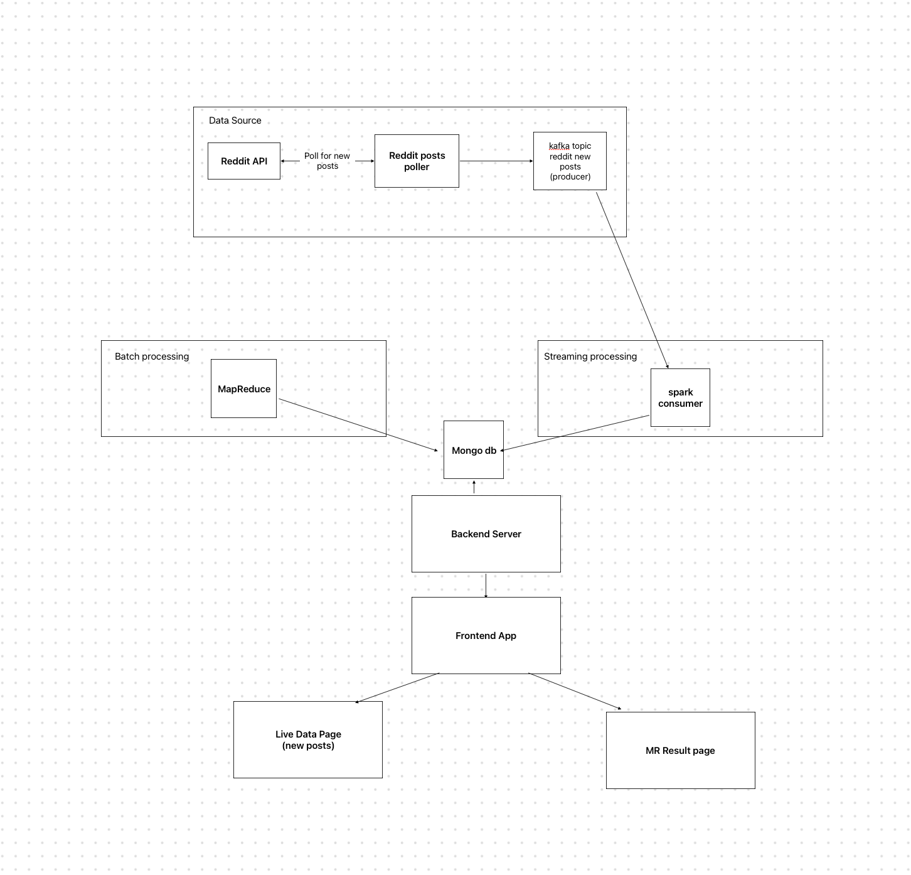
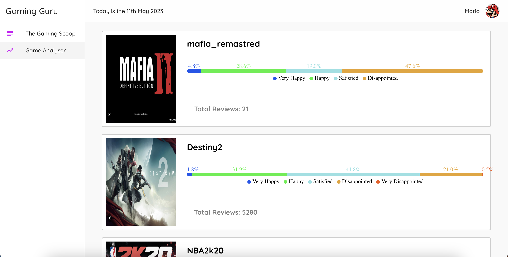
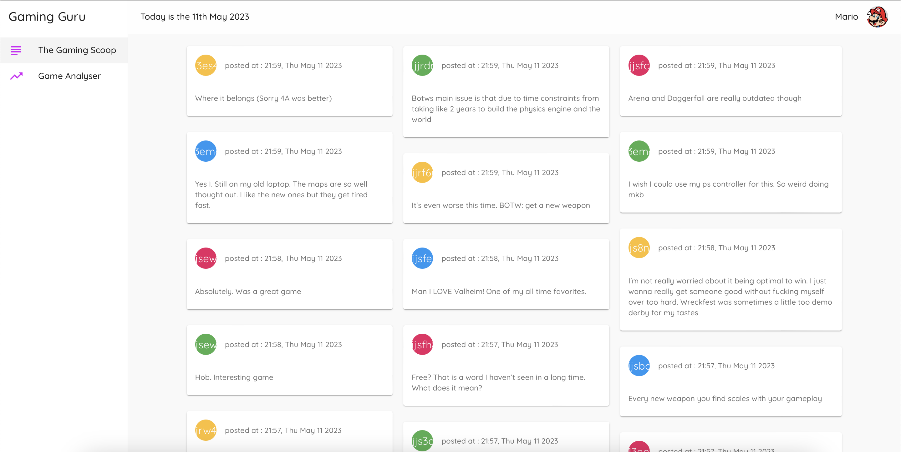

# BigData-Gaming-Guru :
This project was elaborated to acquire practical skills and to explore various techniques and tools specifically designed to handle big data as part of our academic curriculum as software engineers
# Table of content :
<ol>
    <li>About</li>
    <li>Architecture</li>
    <li>Implementation</li>
    <li>Demo</li>
    <li>Ways to improve</li>
  </ol>
  
  # About :
  It is a big data pipeline that uses both batch and stream processing.
  The batch precessing is applied to datasets of game reviews from Steam <a href="[https://www.kaggle.com/datasets/yuanyuwendymu/airline-delay-and-cancellation-data-2009-2018](https://www.kaggle.com/datasets/smeeeow/steam-game-reviews?resource=download)" target="_blank">here</a>.
  And the streaming processing part is applied to posts from reddit that concern gaming.
  The result of both types of processing are then inserted to MongoDB database.
  # Architecture:
  
  # Implementation :
  ### The use of MongoDB :
  MongoDB is known as NOSQL database and can be used effectively in big data scenarios.
  ### Hadoop HDFS :
  File system to distribute data accross multiple machines in the cluster.
  ### Spark Streaming :
  It is a real-time data processing module in Apache Spark that supports streaming processing.
  ### Kafka :
  Kafka is a distributed event store and stream-processing platform.
  ### React & Express :
  React is a free and open-source front-end JavaScript library for building user interfaces.
  Express is a back end web application framework for building RESTful APIs with Node.js.
  # Demo :
   
   
  
   # Ways to improve :
   - One way to improve the project is to add a layer for filtring the posts coming from reddit according to their relevance and/or to group them by talking points.
   - Another way to improve is to add an executable pipeline to automate running and deploying the project.
   
  
